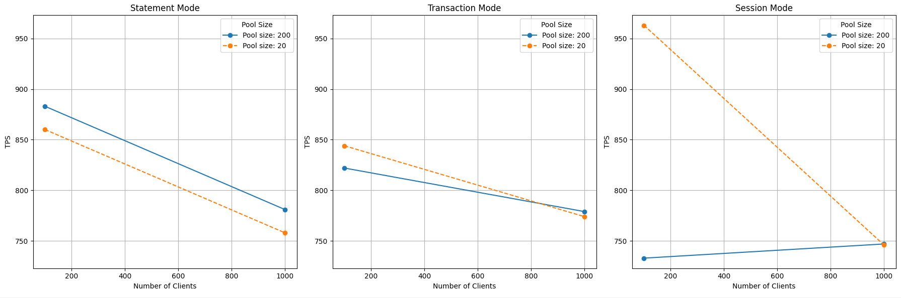

### 1) /usr/lib/postgresql/17/bin/pgbench -c 8 -j 4 -T 10 -f ~/workload.sql -n -U postgres thai
 
       На 8 подключенияк 12к tpx
       еще првоерил на 2 потоках, у меня ВМ на двух ядрах, 16000 тпс

### 2) /usr/lib/postgresql/17/bin/pgbench -c 100 -j 4 -T 10 -f ~/workload.sql -n -U postgres thai
     
       на 100 коннектов 10.6 к
       хотя тут при 2 потоках 9к тпс
     
       c 100 худщая производительность, перегружаем базу   Самое большое время установки соеденений
       и важно еще заметить корреляцию между потоками и коннектами, например при 8 коннектов 4 потока показатели хуже

### 3) /usr/lib/postgresql/17/bin/pgbench -c 8 -j 4 -T 10 -f ~/workload.sql -n -U postgres thai
      
         8 коннектов пг баунсер 16к тпс

### 4) /usr/lib/postgresql/17/bin/pgbench -c 8 -j 4 -T 10 -f ~/workload.sql -n -U postgres -p 5432 -h localhost thai 
   
         8 коннектов TCP 12k tpc

   Линукс сокеты быстрее, нет накладных расходов на сеть

### 5) /usr/lib/postgresql/17/bin/pgbench -c 8 -j 4 -T 10 -f ~/workload.sql -n -U postgres -p 6432 -h 127.0.0.1 thai

         8 коннектов PgBouncer 9.7k tpc

         При 8 подключениях  PgBouncer проигрывает из-за своих накладных расходов

### 6) /usr/lib/postgresql/17/bin/pgbench -c 900 -j 4 -T 10 -f ~/workload.sql -n -U postgres -p 5432 -h localhost thai
      
         0.6k tpc напрямую в базу при 900 коннекшенах

### 7)  /usr/lib/postgresql/17/bin/pgbench -c 200 -j 4 -T 10 -f ~/workload.sql -n -U postgres -p 5432 -h localhost thai

         5,5k tps через pgbounser при 900 коннекшенах
         
         Тут Видно что при большом количестве коннектов пгбаунсер выигрывает

### 8) Провел тестирование в трех режимах, сначала с 1 запросом в workload.sql, затем 3 запроса
 Тест был при 100 и 900 подключениях

| Pool Mode   | Количество подключений | TPS (один запрос) | Latency (ms) | TPS (три запроса) | Latency (ms) |
|-------------|------------------------|-------------------|--------------|-------------------|--------------|
| Statement   | 900                    | 4406.82           | 204.23       | 1509.39           | 596.27       |
| Transaction | 900                    | 4632.14           | 194.29       | 2050.06           | 439.01       |
| Session     | 900                    | 3947.56           | 227.99       | 1958.15           | 459.62       |
| Statement   | 100                    | 6870.65           | 14.56        | 2838.96           | 35.22        |
| Transaction | 100                    | 7140.05           | 14.01        | 2773.81           | 36.05        |
| Session     | 100                    | 7511.34           | 13.31        | 3170.85           | 31.54        |

             При высоком  количестве подключений где в бенче 1 запрос, выигравает Transaction, потом Statement с небольшой 
         разницей (не совсем понимаю почему, ведь тут 1 запрос и разницы не должно быть), а потом Session думаю из-за того что он держит подключение
         и идут наклодные расходы на поддержку коннекта до конца сессии( по бенчу это 10 сек).
            При трех запрсах Transaction и  Statement лидируют с минимальным разрывом, можно списать на погрешность, Statement сильно
         проигрывает ведь ему надо создавать три подключения на 1 бенч

            При низком  количестве подключений где в бенче 1 запрос, выигравает Session, я правда не совсем понимаю почему,
         По моей логике Statement должен быть самым быстрым. 
         При трех запрсах   Session тоже быстрее, на втором месте Statement, хотя я бы подумал что тут уже Transaction должен быть быстрым самым. 

        UPD 
            При 100 клиенах session держит подключения и другие клиенты не создают новое подключение, поэтому и самый быстрый вариант
            При 900 подключениях Transaction лучше так как он освобождает подключения, но не закрывает их как Statement. А Session немного
            проигрывает так как он не освобождает подключение. большинство соединений просто заняты, но не используются. 

### 9)  UPD 22.03.2025
    новый тест с усложненным бенчом(6 запросов в сумме, 3 селекта и 3 апдейта)  (#9)

   | default_pool_size | pool_mode   | Clients | Threads | Duration (s) | Failed (%) | Latency (ms) | TPS  |
   |-------------------|-------------|---------|---------|--------------|------------|--------------|------|
   | 200               | statement   | 100     | 4       | 10           | 0.000      | 113.228      | 883  |
   | 200               | transaction | 100     | 4       | 10           | 0.000      | 121.580      | 822  |
   | 200               | session     | 100     | 4       | 10           | 0.000      | 136.276      | 733  |
   | 20                | statement   | 100     | 4       | 10           | 0.000      | 116.224      | 860  |
   | 20                | transaction | 100     | 4       | 10           | 0.000      | 118.362      | 844  |
   | 20                | session     | 100     | 4       | 10           | 0.000      | 103.768      | 963  |
   | 200               | statement   | 1000    | 4       | 20           | 0.000      | 1280.131     | 781  |
   | 200               | transaction | 1000    | 4       | 20           | 0.000      | 1282.995     | 779  |
   | 200               | session     | 1000    | 4       | 20           | 0.000      | 1338.258     | 747  |
   | 20                | statement   | 1000    | 4       | 20           | 0.000      | 1318.606     | 758  |
   | 20                | transaction | 1000    | 4       | 20           | 0.000      | 1290.703     | 774  |
   | 20                | session     | 1000    | 4       | 20           | 0.000      | 1339.575     | 746  |

### Пул размера 200

| pool_mode   | Clients | Latency (ms) | TPS  |
|-------------|---------|--------------|------|
| statement   | 100     | 113.228      | 883  |
| transaction | 100     | 121.580      | 822  |
| session     | 100     | 136.276      | 733  |
| statement   | 1000    | 1280.131     | 781  |
| transaction | 1000    | 1282.995     | 779  |
| session     | 1000    | 1338.258     | 747  |

### Пул размера 20

| pool_mode   | Clients | Latency (ms) | TPS  |
|-------------|---------|--------------|------|
| statement   | 100     | 116.224      | 860  |
| transaction | 100     | 118.362      | 844  |
| session     | 100     | 103.768      | 963  |
| statement   | 1000    | 1318.606     | 758  |
| transaction | 1000    | 1290.703     | 774  |
| session     | 1000    | 1339.575     | 746  |

         Усложнил запросы бенчмарка и провел тестирование (100, 1000) Clients. (20,200) pull size.
      Сейчас почти всегда стейтмент выигрывает, и при увелечении количества Clients мы всегда видим просадку по ТПС,
      но есть онтересный момент, что при  statement mode Пул размера 200, происходит увелечение ТПС 
      со 100 клиетов до 1000, могу это объяснить тем что при низком количесве Clients лишния соеденения 
      в пуле снижают производительность, так как в statement mode используется 1 соеденения на клиента.   
         При увеличении пула с 20 до 200 режим statement получил борльше тпс, так как там каждый запрос
         в новом соеденений и они не простаивали, в transaction и session наоборот просели, 
         так как были затраты на поддержку пустых конекшенов.
      
      Общие выводы
      Пул = 200, 100 клиентов: Выигрывает statement так как переиспользует все connections в пуле 
      session проигрывает так как есть накладные рассходы на поддержку пустых соеденений,так как их больше чем клиентов

      Пул = 200, 1000 клиентов: Выигрывает statement, но разница уже не такая большая, так как переиспользует все 
      connections в пуле, session проигрывает так как долго держит соеденения

      Пул = 20, 100 клиентов: Выигрывает session, так как не трати время на переключения контекста как statement.
         transaction проигрывает

      Пул = 20, 1000 клиентов: Выигрывает transaction, так как не трати время на переключения контекста как statement 
      и установку/ закртыие соеденений. session проигрывает, так как клиенту долго ждут соеденения при маленьком пуле
      
         

